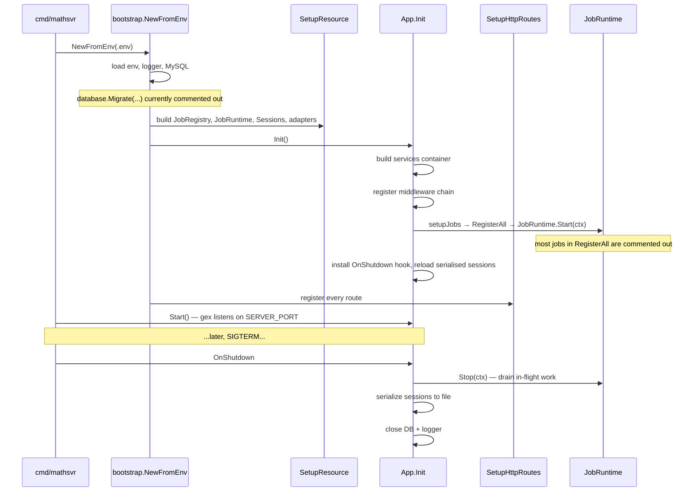
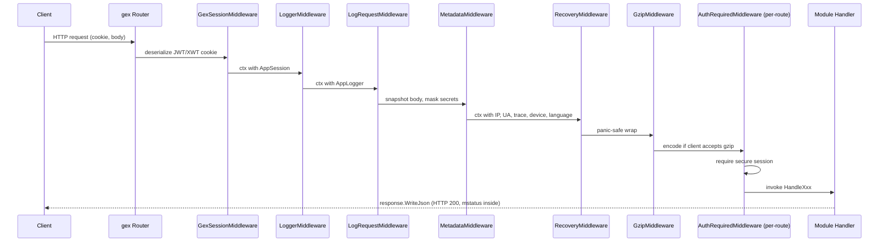
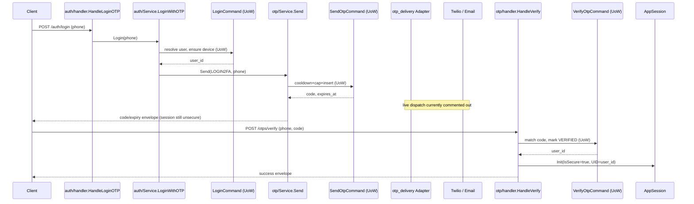
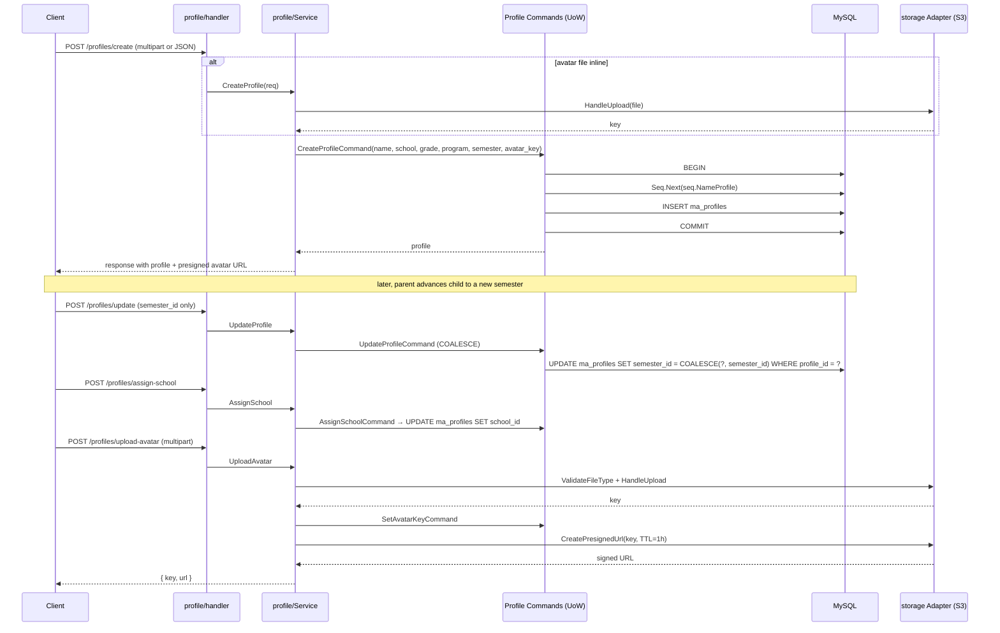
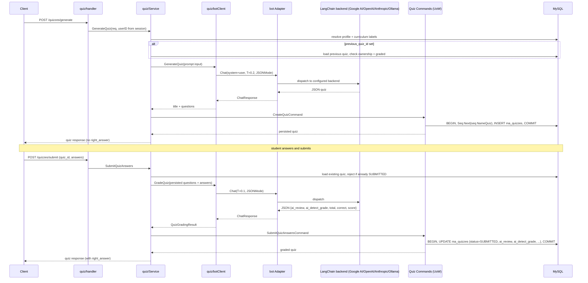
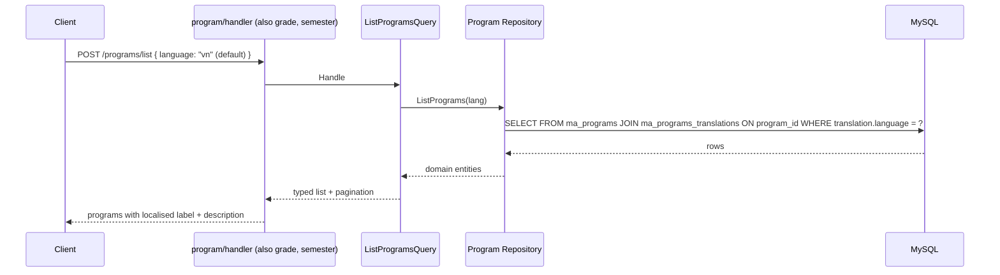
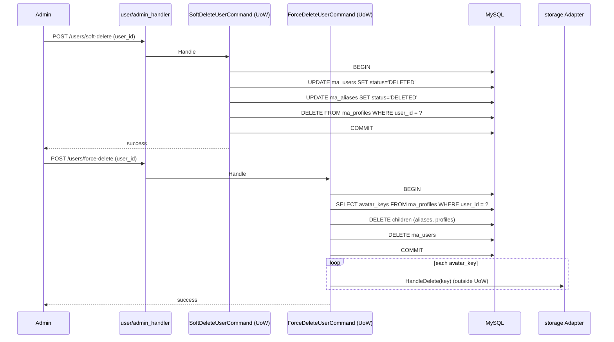

# Math-AI Server — End-to-End Application Flows

> Audience: product / business reviewers. Engineers can use this as a map too,
> but the prose is intentionally light on Go-isms. Every claim cites the file
> it came from so anyone can verify it. File paths are relative to the repo
> root.

## What is math-svr?

**Math-AI Server** (`math-svr`) is the backend for an AI-powered math tutoring
product targeted at Vietnamese elementary students (Grades 1–5). Parents
register, create a child profile, pick a curriculum + grade + semester, and
the server generates personalised quizzes (Assessment / Practice / Exam) by
calling a large-language-model provider through an internal adapter. Teachers
own classrooms, invite students, and issue AI-graded exercises. The Go service
runs as a single binary that bundles the HTTP server and an in-process job
runtime.

## Legend — terms used in every flow

| Term | One-line meaning |
|---|---|
| **Layer** | Hard-walled tier of code. Domain → Application → Infrastructure / Adapter / Module → Bootstrap. |
| **Module (presentation)** | The HTTP-facing layer per aggregate: `handler` → `service` → `validator`. |
| **Command / Query (CQRS-lite)** | Application-layer write-handler (Command) vs read-handler (Query). Lives in `internal/application/command/<agg>/` and `application/query/<agg>/`. |
| **UoW (Unit of Work)** | A single MySQL transaction wrapped by `transaction.UnitOfWork`. Every write — even single-table — runs inside one so cross-row invariants stay atomic. Implementation: [internal/infrastructure/persistence/mysql/unit_of_work.go](internal/infrastructure/persistence/mysql/unit_of_work.go). |
| **Adapter / Provider** | Adapter is the boundary we own (e.g. `bot`, `sms`, `email`, `storage`, `otp_delivery`). Provider is the specific vendor plugged into that adapter (LangChain → Google AI, Twilio, Gmail, S3). |
| **`MathError` + `mstatus`** | Every business error becomes a `MathError`. HTTP always responds 200; the real outcome travels in the JSON body as `mstatus` (numeric) + `mmessage` (localised). See [internal/shared/response/response.go](internal/shared/response/response.go). |
| **int64 IDs via `ma_seqs`** | Every external ID is a 64-bit integer minted inside the UoW by `repos.Seq.Next(ctx, seq.NameX)` against a central `ma_seqs` table. No UUIDs for entities. |
| **Session: `unsecure` vs `secure`** | `unsecure` = login started, OTP pending. `secure` = OTP verified. `AuthRequiredMiddleware` rejects anything not `secure`. Cookie TTL 14 days. |

---

## Table of flows

1. [App boot & shutdown](#1-app-boot--shutdown)
2. [HTTP request middleware chain](#2-http-request-middleware-chain)
3. [Signup + OTP login](#3-signup--otp-login)
4. [Profile lifecycle](#4-profile-lifecycle)
5. [Quiz generate + submit](#5-quiz-generate--submit)
6. [Classroom create + join](#6-classroom-create--join)
7. [Reference data reads (curriculum)](#7-reference-data-reads-curriculum)
8. [Soft-delete vs force-delete](#8-soft-delete-vs-force-delete)

---

## 1. App boot & shutdown

The whole server is built and torn down by `bootstrap.NewFromEnv`. The HTTP
server and the **in-process job runtime** live in one binary; there is no
separate worker process today.

### Boot order

1. Load `.env` into a typed `Env` (`config.NewEnv`).
2. Build the logger provider and bind it as the default.
3. Open MySQL (`database.NewSqlDB`) with TLS 1.2 + pool tuning. **The
   `database.Migrate(...)` call is commented out** ([bootstrap/app.go:43-48](internal/bootstrap/app.go:43)) —
   migrations are applied manually until that line is re-enabled.
4. Wrap the DB pool in `NewDatabaseWithLogs` so every query gets logged.
5. Compose the `Resource` struct (Env + HostConfig + DB).
6. `SetupResource` ([bootstrap/resource.go](internal/bootstrap/resource.go)) constructs, in order:
   `JobRegistry` → `JobRuntime` → `SessionManager` → JWT helper → Session
   provider (JWT or XWT) → Email / SMS / Storage / Bot adapters → composite
   `OtpDelivery` adapter (SMS + Email).
7. `App.Init` builds the service container (`container.SetupServiceContainer`),
   spins up the `gex.Server`, registers middleware, starts the job runtime,
   installs the shutdown hook, and **reloads serialised sessions** from
   `SERIALIZED_SESSION_FILE` if set.
8. `routes.SetupHttpRoutes` ([bootstrap/routes/routes.go](internal/bootstrap/routes/routes.go))
   registers every route — users / auth / OTP / device / profile / classroom
   / quiz / chapter / school / curriculum / job / health.

### Shutdown

When SIGTERM fires, the `OnShutdown` hook ([bootstrap/app.go:188-212](internal/bootstrap/app.go:188)):

1. Drains the `JobRuntime` (stops new schedules, cancels in-flight tasks,
   waits up to `Config().DrainTimeout`).
2. Serialises active sessions to `SERIALIZED_SESSION_FILE` if it's set.
3. Closes the DB pool and the log file.

### Sequence



### What can break
- `SERIALIZED_SESSION_FILE` unset → all signed-in users get logged out on
  every restart (the in-memory session store starts empty).
- Migrations not applied on the target host → fresh DB will reject every
  insert because the tables don't exist. `database.Migrate` is commented out
  in [bootstrap/app.go:43-48](internal/bootstrap/app.go:43); run them manually.
- `BOT_PROVIDER=""` / `disabled` → adapter is `nil`. The bot client surfaces
  `BOT_CONFIG_INVALID` to any quiz generate / submit caller ([module/quiz/bot_service.go:64-67](internal/module/quiz/bot_service.go:64)).
- `RegisterAll` in [internal/jobs/jobs.go](internal/jobs/jobs.go) ships with all real cron jobs
  commented out — only a no-op cron runs. `/jobs/*` endpoints will respond
  `JOB_NOT_FOUND` until that file is uncommented.

---

## 2. HTTP request middleware chain

Every HTTP request walks through a fixed stack registered in
[bootstrap/app.go:121-139](internal/bootstrap/app.go:121). The list is declared
source-outermost-first and then reversed; runtime order is the order shown
below.

### Order at runtime

1. **`GexSessionMiddleware`** — reads the JWT/XWT cookie via
   `sessionprovider.SessionProvider`, deserialises it into an `AppSession`,
   and stashes it at `session.SessionContextKey`.
2. **`LoggerMiddleware`** — builds an `AppLogger` bound to the request,
   stamps every line with `[traceID] [uid] [METHOD path]`.
3. **`LogRequestMiddleware`** — snapshots request and response bodies, masking
   `Authorization`, `Cookie`, `password`, `token`, `otp`, `secret`, etc.
4. **`MetadataMiddleware`** — extracts IP, user-agent, trace id, device id,
   device name, push token, client language, binds them to ctx so any handler
   can call `metadata.GetIPAddress(ctx)` / `metadata.GetClientLanguage(ctx)`.
5. **`RecoveryMiddleware`** — catches panics, returns 500 envelope.
6. **`GzipMiddleware`** — compresses the response when the client sent
   `Accept-Encoding: gzip`.
7. **Per-route `AuthRequiredMiddleware`** — only on protected routes (the
   third arg to `gexSvr.AddRoute(...)` in
   [bootstrap/routes/routes.go](internal/bootstrap/routes/routes.go)). Rejects
   anything whose session is not `secure`.

Plus `gexSvr.SetupServerCORS()` for cross-origin support.

### Public routes (intentionally no `authMiddleware`)
- `GET /ping`
- `POST /users/create`
- `POST /auth/login`, `POST /auth/otp`
- `POST /otps/send`, `POST /otps/verify`
- `POST /programs/list`, `POST /grades/list`, `POST /semesters/list`
- All of `/devices/*` (mobile rollout self-registers before login)
- `POST /sessions/dump`, `POST /sessions/delete-all`

See the `known-issues.md` note: the public `/devices/*` and `/sessions/*`
sets are known soft-spots.

### Sequence



### What can break
- Missing or malformed cookie → `GexSessionMiddleware` produces an
  `unsecure` empty session; `AuthRequiredMiddleware` then rejects with an
  `UNAUTHORIZED` envelope.
- Handler forgets to use `response.WriteJson` and writes the response
  directly → the client sees a non-envelope body and breaks parsing.
- New sensitive field added to a request payload without updating the redact
  list in `LogRequestMiddleware` → secrets leak into the log file.

---

## 3. Signup + OTP login

The product uses phone-based OTP login (no passwords in production).
Signup creates a user + alias rows + a default child profile. Login is a
two-step ceremony: `/auth/login` issues an OTP, `/auth/otp` consumes it and
flips the session from `unsecure` to `secure`. Both write paths run inside a
single UoW.

### Signup — `POST /users/create` (public)

1. Handler [module/user/handler.go](internal/module/user/handler.go)
   decodes `CreateUserReq` (phone required, email + username optional).
2. Validator ensures phone format + uniqueness preconditions.
3. `CreateUserCommandHandler.Handle` ([application/command/user/create_user_command.go](internal/application/command/user/create_user_command.go))
   runs in one UoW: mints `user_id` via `repos.Seq.Next(ctx, seq.NameUser)`,
   inserts `ma_users`, inserts one `ma_aliases` row per non-empty email/phone,
   then creates the **default child profile** with `is_default = true`. The
   profile is intentionally `INCOMPLETE` — curriculum (program/grade/semester)
   is filled in later via `/profiles/update`.
4. Response envelope returned via `response.WriteJson`.

### Login step 1 — `POST /auth/login` (public)

1. Handler [module/auth/handler.go:25-50](internal/module/auth/handler.go:25)
   gets the request session (cookie-bound), calls
   `Service.Login` ([module/auth/service.go:38-93](internal/module/auth/service.go:38)).
2. `LoginCommandHandler.Handle` ([application/command/auth/login_command.go](internal/application/command/auth/login_command.go))
   inside a UoW resolves the user by phone. If found, returns
   `TwoFactorRequired = true`. The device-row management (`ensureDevice`,
   login-log creation) is currently commented out — the live path is the
   simpler resolve-and-return.
3. Back in the service, the session is initialised with `IsSecure=true`,
   `UID = user.UserID`. **(In the OTP-disabled path the login already
   completes here.)**

### Login step 2 — `POST /auth/otp` (public)

`HandleLoginOTP` ([module/auth/handler.go:53-97](internal/module/auth/handler.go:53))
branches on `env.EnableOTP`:

- `EnableOTP == false` → behaves identically to `/auth/login`: session goes
  straight to `secure`.
- `EnableOTP == true` → `Service.LoginWithOTP` resolves the user, then calls
  `otp.Service.Send` which delegates to `SendOtpCommand` and the
  `otp_delivery` adapter. The OTP code, expiry, and channel are returned to
  the client. The session **stays unsecure**. A second call to
  `POST /otps/verify` (`module/otp/handler.go` → `verifyCmd.Handle` →
  `VerifyOtpCommand`) is what flips the session to `secure`.

### Inside the OTP send/verify commands

- `SendOtpCommand` ([application/command/otp/send_otp_command.go](internal/application/command/otp/send_otp_command.go))
  in a single UoW: enforces resend cooldown, enforces per-window send cap
  (`OTP_RATE_LIMITED`), revokes any prior PENDING row, mints `otp_id` via
  `seq.NameOtp`, inserts a fresh row, returns expiry + channel. **Delivery
  via `otp_delivery.SendVia` is currently commented out** — the code is
  returned in the response for now (intended for dev). The auto-detect rule:
  identifier contains `@` → email, else SMS.
- `VerifyOtpCommand` ([application/command/otp/verify_otp_command.go](internal/application/command/otp/verify_otp_command.go))
  in a single UoW: finds the latest PENDING row, marks `EXPIRED` if past TTL,
  increments attempts before comparing the code (so brute force fails by
  cap), marks `VERIFIED` on success, returns `UserID` + `DeviceUUID`.

### Sequence (OTP-enabled path)



### What can break
- `BOT_PROVIDER` has no bearing here, but `SMS_PROVIDER=""` plus an email-less
  user means the OTP can't reach anyone — the response still returns the code
  in dev, but in a tightened prod build that path is the only one users have.
- Cooldown / cap fires `OTP_TOO_FREQUENT` / `OTP_RATE_LIMITED` — these are
  not bugs, they're rate-limit responses.
- Sessions live in memory; if the server restarts without
  `SERIALIZED_SESSION_FILE`, every signed-in user gets bumped back to
  `/auth/login` (see Flow 1).
- The login flow does **not** verify the device today (the `ensureDevice` /
  loginlog path is commented out in `login_command.go`). Returning to the
  full design will require uncommenting both blocks together.

---

## 4. Profile lifecycle

A **profile** is the *child* — one parent (`ma_users`) can hold many profiles
(`ma_profiles`). Curriculum (program/grade/semester) and school assignment
all live on the profile. Avatars are uploaded to S3 via the `storage`
adapter. Routes are registered in
[bootstrap/routes/routes.go:89-105](internal/bootstrap/routes/routes.go:89).

### Create — `POST /profiles/create` (auth)

1. Handler [module/profile/handler.go:43-89](internal/module/profile/handler.go:43)
   accepts JSON or multipart form. Multipart lets the client send the avatar
   file inline.
2. `Service.CreateProfile` ([module/profile/service.go:147](internal/module/profile/service.go:147)):
   if an avatar file is included, it's uploaded to S3 first
   (`storageProvider.HandleUpload`); the key is then handed to
   `CreateProfileCommand`. If the upload + insert fails partway, the upload is
   compensated by `HandleDelete`.
3. `CreateProfileCommand` runs in a UoW: mints `profile_id` from
   `seq.NameProfile`, inserts the row with `program_id` / `grade_id` /
   `semester_id` / `school_id` set as supplied.

### Update — `POST /profiles/update`

Same dual-mode (JSON or multipart). `UpdateProfileCommand` uses
`COALESCE(?, col)` so any field left `nil` keeps its existing value — the
parent only sends what's changing (e.g. just the new grade for next term).

### Assign / remove school

- `POST /profiles/assign-school` → `AssignSchoolCommand` writes
  `school_id` onto the profile inside a UoW.
- `POST /profiles/remove-school` → `RemoveSchoolCommand` nulls it.

The classroom layer carries an *independent* `school_id`; the link is
informational, not a permission scope.

### Avatar upload — `POST /profiles/upload-avatar`

1. Handler limits body to 10 MB (`MaxAvatarUploadSize`), parses multipart.
2. `Service.UploadAvatar` ([module/profile/service.go:375-432](internal/module/profile/service.go:375))
   validates file type, calls `storageProvider.HandleUpload`, then
   `SetAvatarKeyCommand` to persist the new key, then
   `CreatePresignedUrl` for the client preview.
3. Old avatar key (if any) is deleted from S3 best-effort outside the UoW.

### Sequence



### What can break
- `STORAGE_PROVIDER` disabled → `s.storageProvider == nil` and avatar paths
  return `PROFILE_AVATAR_*` errors (the service nil-guards explicitly at
  [module/profile/service.go:380](internal/module/profile/service.go:380)).
- Multipart form > 10 MB → the handler returns `PROFILE_AVATAR_INVALID_FILE`.
- Field absent vs field empty matters: `multipartTextValue` distinguishes
  the two so an unset field doesn't blank a column.

---

## 5. Quiz generate + submit

The headline AI feature. The student requests a quiz; the server resolves
curriculum labels, calls the LLM, persists the result, and returns it
without revealing answer keys. On submit, the server either re-asks the LLM
to grade (`/quizzes/submit`) or grades deterministically in process
(`/quizzes/submit/v2`). Both submit paths persist `ai_review` and an
inferred `ai_detect_grade` so the parent UI can suggest the child's level
may have changed.

### Generate — `POST /quizzes/generate` (auth)

1. Handler ([module/quiz/handler.go:28-55](internal/module/quiz/handler.go:28))
   reads the session, attaches `UserID` from session, decodes
   `GenerateQuizReq`.
2. `Service.GenerateQuiz` ([module/quiz/service.go:85-206](internal/module/quiz/service.go:85)):
   - Resolves the profile (explicit `profile_id` → exact lookup; else default
     profile for the user). Anonymous quizzes are allowed if no profile fits.
   - Builds `curriculumContext` — program/grade/semester labels and chapter
     descriptions are filled from the request, the profile, then left empty.
   - If `previous_quiz_id` is set, loads it. Ownership is checked (`QUIZ_NOT_OWNED`)
     and the previous quiz must already be graded (`QUIZ_PREVIOUS_NOT_GRADED`).
   - Calls `botClient.GenerateQuiz` ([module/quiz/bot_service.go:62-120](internal/module/quiz/bot_service.go:62))
     **outside the UoW** (slow I/O must not hold a tx). The bot adapter dispatches
     to LangChain at Temperature 0.2, JSONMode true.
   - Parses the LLM JSON into typed `QuizQuestion` values, marshals
     `Questions` to JSON, then persists via `CreateQuizCommand` (UoW: mints
     `quiz_id`, inserts row, sets owner user/profile ids).
   - Returns the quiz with `include_answers=false` — live quizzes never
     surface `right_answer` to the student.

### Submit — `POST /quizzes/submit` (auth)

1. Handler [module/quiz/handler.go:58-72](internal/module/quiz/handler.go:58).
2. `Service.SubmitQuizAnswers` ([module/quiz/service.go:211-310](internal/module/quiz/service.go:211)):
   - Loads the existing quiz; rejects `QUIZ_ALREADY_SUBMITTED`, `QUIZ_NOT_FOUND`,
     `QUIZ_GRADING_FAILED` (no questions).
   - Builds a `gradeQuizInput`. For Reinforcement-mode rounds, the current
     grade label is resolved from the profile.
   - Calls `botClient.GradeQuiz` at Temperature 0.1, JSONMode true.
   - Parses the LLM JSON into `QuizGradingResult` (`AIReview`,
     `AIDetectGrade`, `TotalQuestions`, `CorrectNumber`, `ScorePercentage`).
   - `SubmitQuizAnswersCommand` runs in one UoW: updates the row with the
     graded payload, flips `quiz_status` to `SUBMITTED`.
   - Response includes answers (`include_answers=true`) so the UI can show
     correct/incorrect indicators.

### Submit v2 — `POST /quizzes/submit/v2` (auth)

Same request/response shape as v1 but **no bot call**. The new
`SubmitQuizAnswersV2Command` grades deterministically in process (see
`internal/application/command/quiz/scorer.go`). The trade-off is no
`ai_detect_grade`.

### Sequence



### What can break
- `BOT_PROVIDER` disabled → `botClient.adapter == nil` → both generate
  and submit-v1 return `BOT_CONFIG_INVALID`. Submit-v2 still works.
- Backend rate-limits or returns non-JSON → parser fails, response is
  `QUIZ_GENERATION_FAILED` / `QUIZ_GRADING_FAILED` with a `reason` payload.
- Reinforcement round without a prior submitted quiz → `QUIZ_PREVIOUS_NOT_GRADED`.
- The bot call sits outside the UoW; if the server crashes after the bot
  call but before the DB write, the response is lost. The bot is idempotent
  here — re-running generation simply costs a fresh LLM call.

---

## 6. Classroom create + join

Classrooms are the teaching-side aggregate. A `ma_classrooms` row is owned
by exactly one profile (`owner_profile_id`); it holds many members
(`ma_classroom_members`, role ∈ {OWNER, TEACHER, STUDENT}), many programs
(`ma_classroom_programs` — many-to-many junction), and many invitations
(`ma_classroom_invitations`). Counter columns (`member_count`,
`student_count`, `teacher_count`) are denormalised onto the classroom row
and advanced via `IncCounts` inside the same UoW as the membership mutation.

### Create — `POST /classrooms/create` (auth)

1. Handler [module/classroom/handler.go](internal/module/classroom/handler.go).
2. `CreateClassroomCommand` ([application/command/classroom/create_classroom_command.go](internal/application/command/classroom/create_classroom_command.go))
   runs the following inside one UoW:
   - Resolve or mint `classroom_code` (an "AA-1111"-style invite code).
     Client-supplied codes precheck for uniqueness (`CLASSROOM_CODE_TAKEN`);
     minted codes retry on collision.
   - Mint `classroom_id` via `seq.NameClassroom`. Insert `ma_classrooms` with
     initial counters `member_count=1`, `teacher_count=1`, `student_count=0`.
   - Mint `member_id` via `seq.NameClassroomMember`. Insert the OWNER member
     row pointing at `cmd.OwnerProfileID`, role = `OWNER`.
   - For every supplied `program_id`, insert a junction row in
     `ma_classroom_programs`. Hydrated as an empty slice when none.

### Join paths

Two entry points lead to membership, and they intentionally split into
*invitation* (teacher-initiated) and *join request* (user-initiated).

- **Find by code** — `POST /classrooms/find-by-code` — read-only.
- **Join by code** — `POST /classrooms/join-by-code` →
  `JoinByCodeCommand` ([application/command/classroom/join_by_code_command.go](internal/application/command/classroom/join_by_code_command.go)):
  resolves the classroom by code; rejects `CLASSROOM_CODE_DISABLED` if
  archived or `CLASSROOM_CODE_EXPIRED` if past the expires-dt; checks for an
  existing member row (`ALREADY_MEMBER` / `ALREADY_INVITED` /
  `JOIN_REQUEST_ALREADY_PENDING`); else inserts a fresh member row with
  `member_status = PENDING_REQUEST`. **Capacity (`max_members`) is NOT
  enforced here** — it's checked only when the owner approves.
- **Approve / reject** — `POST /classrooms/join-requests/approve` →
  `ApproveJoinRequestCommand` advances the row to `ACTIVE`, increments
  counters via `IncCounts`, and enforces capacity at this point.
- **Invitation flow** — Teacher calls `POST /classrooms/invitations/send` to
  create a `ma_classroom_invitations` row (status = PENDING_INVITATION). User
  calls `POST /classrooms/invitations/accept` to flip it to ACTIVE.

### Sequence

```mermaid
sequenceDiagram
    participant Teacher
    participant Student
    participant H as classroom/handler
    participant CmdC as CreateClassroomCommand (UoW)
    participant CmdJ as JoinByCodeCommand (UoW)
    participant CmdA as ApproveJoinRequestCommand (UoW)
    participant DB as MySQL

    Teacher->>H: POST /classrooms/create (name, owner_profile_id, programs[])
    H->>CmdC: BEGIN
    CmdC->>DB: ensure / mint classroom_code
    CmdC->>DB: Seq.Next(seq.NameClassroom)
    CmdC->>DB: INSERT ma_classrooms (counters seeded)
    CmdC->>DB: Seq.Next(seq.NameClassroomMember)
    CmdC->>DB: INSERT OWNER member
    loop each program_id
        CmdC->>DB: INSERT ma_classroom_programs
    end
    CmdC->>DB: COMMIT
    CmdC-->>Teacher: classroom (with code)

    Teacher-->>Student: share classroom_code (out of band)

    Student->>H: POST /classrooms/join-by-code (code)
    H->>CmdJ: resolve+check+insert (UoW)
    CmdJ->>DB: SELECT by classroom_code (reject if archived/expired)
    CmdJ->>DB: SELECT existing member; if rejected/left → reactivate as PENDING_REQUEST
    CmdJ->>DB: INSERT ma_classroom_members status=PENDING_REQUEST
    CmdJ->>DB: COMMIT
    CmdJ-->>Student: pending member row

    Teacher->>H: POST /classrooms/join-requests/approve (member_id)
    H->>CmdA: enforce capacity, flip status, bump counters (UoW)
    CmdA->>DB: UPDATE member status=ACTIVE
    CmdA->>DB: classroom.IncCounts (+1 member, +1 student/teacher)
    CmdA->>DB: COMMIT
    CmdA-->>Teacher: success
```

### What can break
- Classroom code collision under load → `CreateClassroomCommand` retries the
  mint; the `(classroom_code)` UNIQUE key is the hard backstop.
- `max_members` reached → `ApproveJoinRequestCommand` returns the capacity
  error; queued PENDING requests stay queued until seats open.
- Manual update of `member_count` without `IncCounts` will desync — always
  go through the helper inside the same UoW as the membership mutation.
- Counts can become wrong if any classroom member row is `DELETE`d outside
  the helper paths.

---

## 7. Reference data reads (curriculum)

Programs, grades, semesters are the curriculum reference tables. Every one
carries a `*_translations` table with VN + EN strings. The list endpoints
are **public** (`/programs/list`, `/grades/list`, `/semesters/list`) because
the mobile app needs them at the splash screen, before login. Get/Create/
Update/Soft-delete/Force-delete are all gated by `authMiddleware`.

Default language is Vietnamese (`enum.LanguageTypeVietnamese`) — both at the
`errs.NewError` site and in repository queries when no explicit
`language` is supplied.

### Sequence



### What can break
- Missing translation row for a program in the requested language → JOIN
  drops the program. Always seed both VN and EN.
- Curriculum tables are seeded externally today — admin endpoints exist but
  rows usually arrive via SQL.

---

## 8. Soft-delete vs force-delete

Almost every aggregate exposes both flavours: **soft-delete** keeps the row
and flips status columns to `DELETED` (hidden by `*ActiveWhere` filters);
**force-delete** physically removes the row and any children. Children are
removed *before* the parent so the cascade is safe even if FK constraints are
added later.

### User — the canonical example

- `POST /users/soft-delete` (auth) →
  `SoftDeleteUserCommand` ([application/command/user/soft_delete_user_command.go](internal/application/command/user/soft_delete_user_command.go))
  inside one UoW:
  1. `repos.User.SoftDeleteByUserId` → `status = DELETED` on `ma_users`.
  2. `repos.Alias.SoftDeleteByUserId` → matching aliases.
  3. `repos.Profile.ForceDeleteByUserId` → profiles are physically removed.

- `POST /users/force-delete` (auth) →
  `ForceDeleteUserCommand` ([application/command/user/force_delete_user_command.go](internal/application/command/user/force_delete_user_command.go))
  inside one UoW:
  1. `repos.Profile.ListAvatarKeysByUserId` — collect S3 keys *before* the
     tx commits.
  2. `repos.Alias.DeleteByUserId` (children first).
  3. `repos.User.DeleteByUserId`.
  4. `repos.Profile.ForceDeleteByUserId`.
  5. After commit, the service calls `storageProvider.HandleDelete` on each
     collected avatar key — slow I/O must not hold a DB lock.

Both endpoints are idempotent: zero-rows-affected at any step is fine.

### Sequence



### What can break
- Soft-delete leaves the row in the DB; clients that bypass `*ActiveWhere`
  filters can still see it.
- Force-delete is irreversible. The route currently shares the same
  `authMiddleware` as any other authenticated endpoint — there is no admin
  role gate yet (see `known-issues.md` #11).
- If S3 delete fails after the tx commits, the avatar key is orphaned; the
  user row is gone but the file lingers. This is logged but not retried.

---

## Glossary cheat-sheet

| Acronym / token | Expansion |
|---|---|
| UoW | Unit of Work — one MySQL transaction |
| CQRS | Command-Query Responsibility Segregation |
| OTP | One-Time Password |
| JWT / XWT | Session cookie formats supported by `gex` |
| `ma_*` | All MySQL table names start with this |
| `mstatus` / `mmessage` | Numeric outcome code + localised message in the response envelope |
| `seq.Name*` | Constants in `internal/domain/seq/names.go` |

---

*Generated from the source on 2026-06-08. Edit this file, not the code.*
