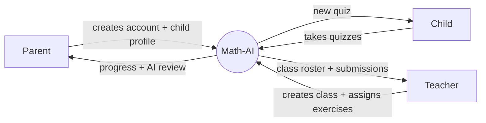
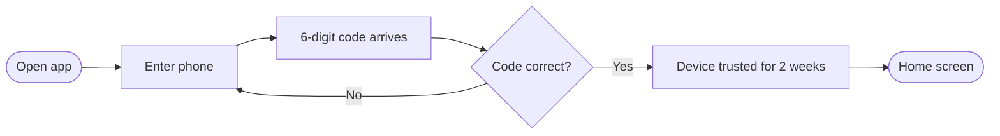
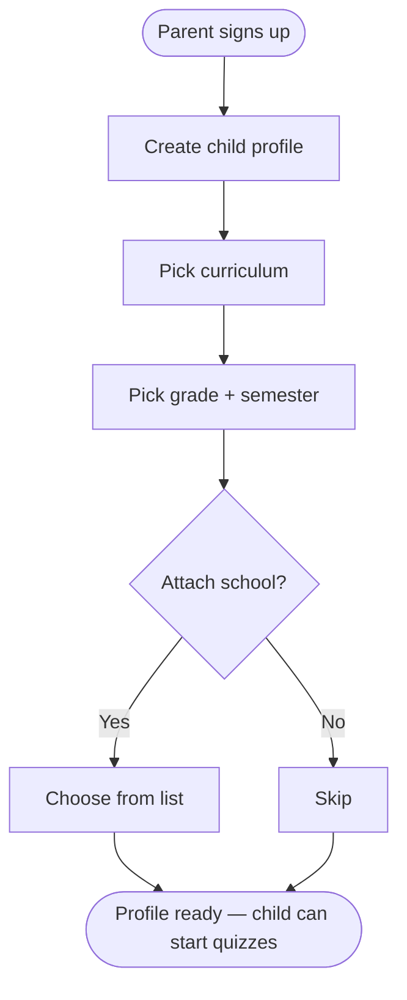
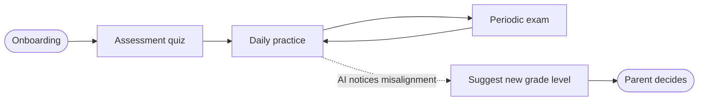
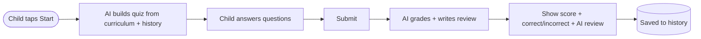
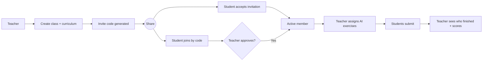
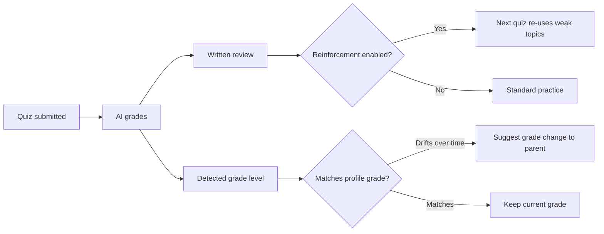
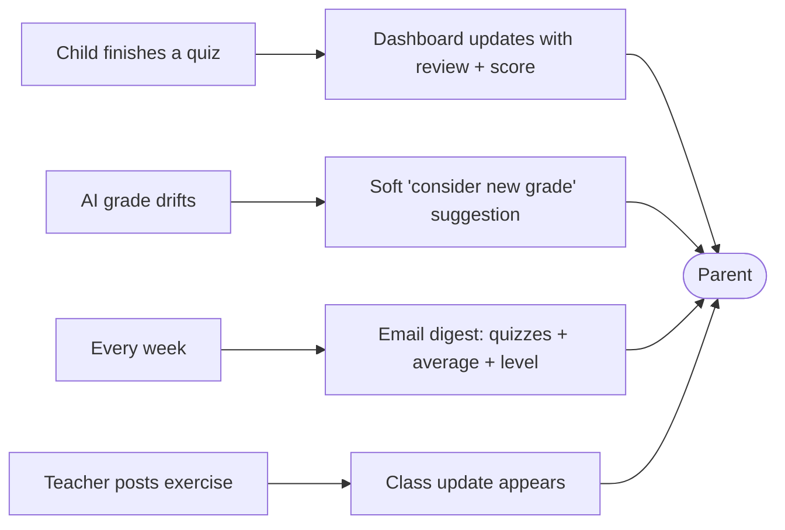

# Math-AI — Product Overview

> A plain-English tour of what Math-AI does, journey by journey.
> Audience: product reviewers and stakeholders. No technical jargon.

## What is Math-AI?

Math-AI is a Vietnamese math tutoring app for elementary-school children
(Grades 1–5). A parent signs up, creates a profile for their child, picks the
curriculum the school uses, and the app generates personalised math quizzes
the child can take on their own. The AI checks each quiz, writes a short
review, and — over time — suggests if the child is ready to move up a grade
or needs more practice at the current level. Teachers can also create a
class, invite their students, and assign exercises that the AI grades for
them.

---

## 1. Who uses Math-AI

There are three kinds of users, and a single account can act as more than
one of them at the same time:

- **Parent** — owns the account, creates a profile for each child, watches
  progress, receives the AI's review after each quiz.
- **Child** — sits down to take the quizzes the app prepares. Sees only
  age-appropriate content in Vietnamese (English is available as a
  secondary language).
- **Teacher** — creates a class, invites students, sends out exercises, and
  reviews who completed what.

What each gets out of the app:
- The parent gets a simple way to keep their child practising math at the
  right level without having to design quizzes themselves.
- The child gets fresh, curriculum-aligned quizzes that adapt to their
  performance.
- The teacher gets a way to assign and grade math exercises at scale.

---

## 2. Signing up and logging in

Sign-up uses the parent's phone number. There is no password to remember —
each time someone logs in, the app sends a one-time code to their phone
that they type in to confirm it's really them. Once confirmed, the device
they're using is remembered for two weeks so they don't have to repeat the
process every day.

Steps the user sees:
- Enter phone number.
- Receive a 6-digit code by SMS (or by email if they signed up with an
  email address).
- Type the code into the app.
- They're in — and the device is now trusted.

---

## 3. Setting up a child profile

Right after sign-up the parent creates a profile for their child. The
profile is what the app uses to pick the right curriculum, grade, and
chapters. A parent with more than one child simply creates one profile per
child.

What the parent fills in:
- The child's name and (optionally) an avatar photo.
- The curriculum the child's school uses (Math-AI ships with all five
  official Vietnamese elementary curricula).
- The child's current grade and semester.
- Optionally, the school the child attends.

When the school year advances, the parent simply updates the profile —
there's no re-onboarding. The profile is the single switch that re-targets
every future quiz to the new grade or semester.

---

## 4. Daily learning loop

The product is designed around a simple cycle: figure out where the child
is, give them practice at that level, and check in periodically with a
bigger exam.

- **Assessment** quiz — used at the start, or any time the parent wants the
  app to re-evaluate. The AI inspects the child's answers and forms an
  opinion about which grade level fits them best.
- **Practice** quiz — the everyday format. Aims to keep the child engaged
  with fresh questions and, when the parent enables it, re-surfaces the
  kinds of questions the child got wrong last time.
- **Exam** quiz — a heavier mock test aligned to a semester checkpoint.

Over time the AI's view of the child's level can drift away from the
profile's official grade. The app surfaces this gently as a *suggestion* to
the parent — never a silent change.

---

## 5. Quiz experience

Whenever the child starts a quiz, the app builds it on the spot — quizzes
aren't picked from a fixed bank. The AI is told the child's curriculum,
grade, semester, the chapters they're studying, and (when the parent has
turned on reinforcement) what the child got wrong last time. It writes a
fresh set of questions tailored to that context.

What the child sees:
- A short topic title and a set of questions.
- They answer one by one, then tap submit.
- Within seconds the app comes back with a score, which answers were right
  or wrong, and a short written review from the AI.

What the parent sees:
- The same score and review on their dashboard, plus the AI's read on the
  child's current level.

---

## 6. Classroom — the teacher side

A teacher creates a class inside the app and gets back a short invite
code. Students join either by typing the code or by accepting an
invitation the teacher sends them. The teacher picks which curricula the
class targets (a class can cover more than one), and from then on can
assign AI-generated exercises to everyone in the room.

Steps the teacher sees:
- Create a class — pick name, optional school, curriculum, and an optional
  cap on size.
- Share the invite code (or send invitations directly).
- Approve join requests as they come in.
- Assign exercises and watch submissions land. The AI grades each one.

Steps the student sees:
- Receive the code or invitation.
- Tap to join.
- See the class on their list once the teacher approves.
- Take the exercises the teacher posts.

A class can be archived (hidden but recoverable) or deleted entirely.
Member counts on the class — total members, students, teachers — stay in
sync automatically as people join or leave.

---

## 7. How the system gets smarter

Math-AI doesn't just grade quizzes — it tracks two signals that gradually
sharpen what the child sees:

- **AI-detected grade.** Every time a quiz is graded, the AI also makes a
  judgement call about which grade level the child *seems* to be at. When
  this drifts away from the profile's official grade for several quizzes in
  a row, the app suggests the parent consider moving the child up or down.
- **Wrong-answer reinforcement.** When the parent turns on the reinforcement
  mode, the next practice round leans on the question types the child got
  wrong last time. Each round still produces a fresh question set — the
  child isn't shown the same prompts twice.

The parent always has the final say. The app never silently moves a child
to a new grade.

---

## 8. Notifications and follow-ups for the parent

The parent's view of progress is fed by a small set of touchpoints:

- **After every quiz.** The AI's written review and the score appear right
  away on the parent's dashboard.
- **AI-detected grade hint.** When the AI's view of the child's level
  diverges from the profile, the parent sees a soft suggestion to update
  the profile.
- **Weekly digest.** A scheduled summary that rolls up the past week's
  activity — how many quizzes the child finished, the average score, and
  whether the child's level has shifted — sent through email.
- **Classroom updates.** When the child is enrolled in a class, new
  exercises and join-request decisions show up in the same notification
  stream.

Together these keep the parent informed without overwhelming them, and they
always lead the parent back into the app to take action — update the
profile, schedule more practice, or simply celebrate a good week.

---

*Edit this file to reshape what gets built — every section maps onto a
visible part of the product.*
